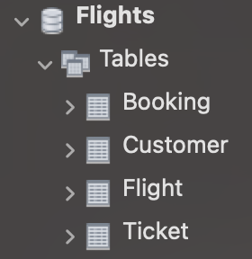
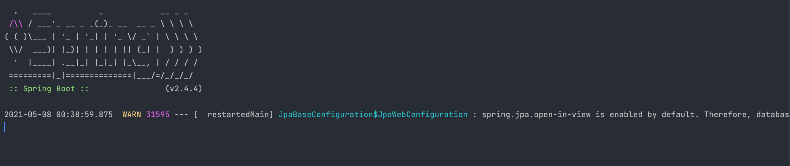
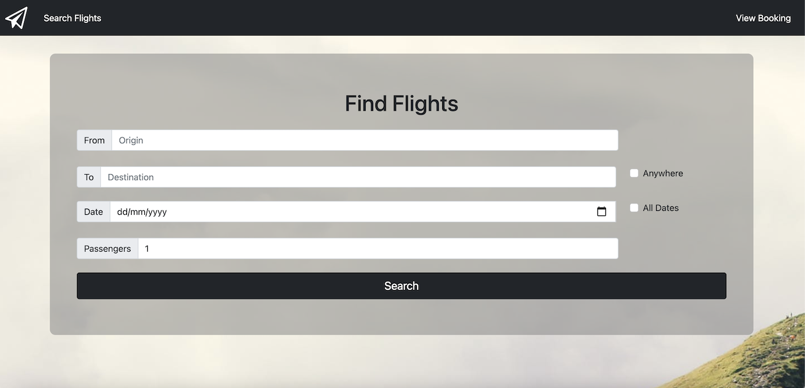
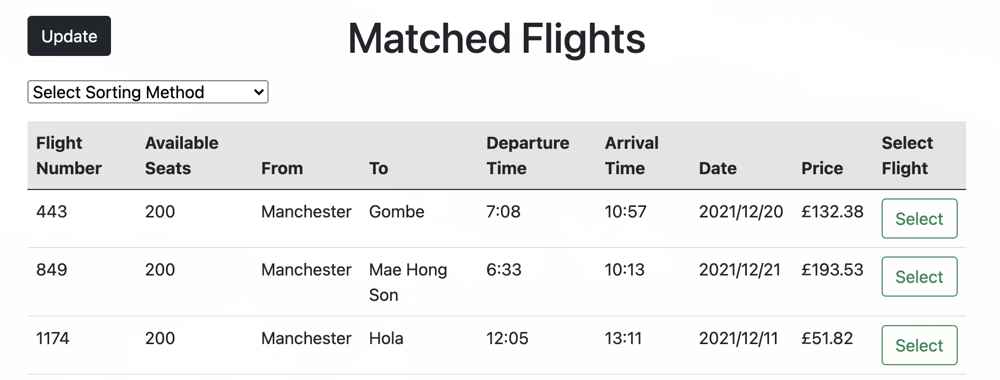
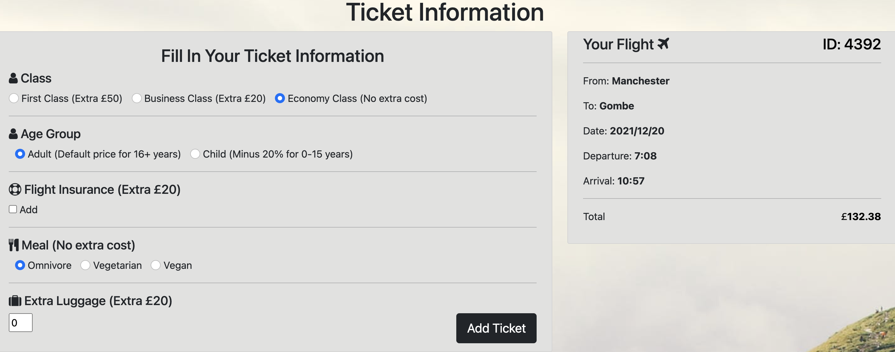
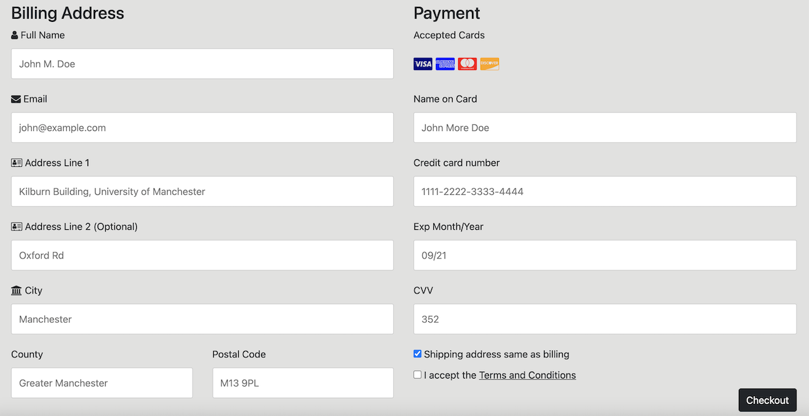
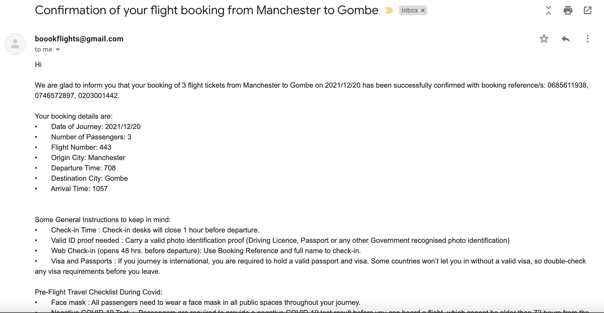
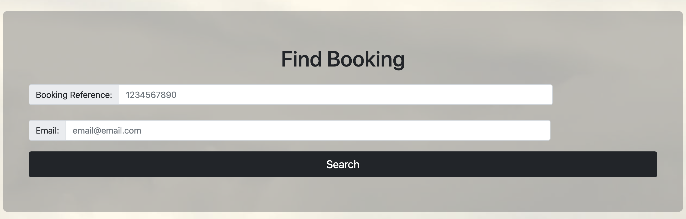

# COMP62542: Pattern-Based Software Development
# Team 5 - Online Booking System (Fly Away)

INTRODUCTION
------------

A Java-based e-commerce application using at least 4 design patterns, plus the MVC (Model View Controller) architectural pattern.

* Links:
  * Trello Board: https://trello.com/b/gPfS4Vgj

REQUIREMENTS
------------

* You will need an IDE (integrated development environment).

    - We recommend you use the IntelliJ IDEA (It's very powerful to support your spring web application development and integration of many technical frameworks).

* We recommend Chrome or Firefox as your web browser.

* You will need to have JDK.

* You will need to download and install MySQL.

CONFIGURATION
-------------

* You will need to configure the database in MySQL.

    - You will need to create a new database called "Flights".

    - You will need set the database username: "root" and password: "12345678"

    - Run the "tables.sql" file (You will find it in the MySQLConfig folder) to create three tables (Ticket, Customer, Booking).
      
    - Run the "allFlightInformation.sql" file (You will find it in the MySQLConfig folder) to creat the "Flight" table and populate it with all the flight information (There are many flights/information, so it might take some extra time to complete).
        
    - As a result, you should have one database (Flights) with four tables (Flight, Ticket, Customer, Booking), and the table Flight filled with the flight information.
  
  Your database finally should look like this:

  

  
    
  
 

HOW TO USE
-------------

* Run the OnlineBookingSystemApplication in your preferred IDE.
* Once up and running, Go to your browser and paste: http://localhost:8080/
  
  
  
* You should be able now to see the Home Page.
  
  

  
  
  
  
* From the Home Page you can search for flights departing from and arriving to, on a specific date and number of passengers (tickets).
  * You can also search for flights departing from and arriving anywhere or all available dates. This will return all available connecting flights.
* The next page is all available flights and from there you can select the one you want or update you search preferences.

  

  
  
 
  
* By selecting the flight, you move to the next page where you add extra information/services for each passenger.

  

  
  
 
  
* Once you have added all information press Pay and go to the checkout page where you can pay and checkout.

  

  
  
 
  
* Finally, you will receive a Confirmation email with all the information needed for your flight.

  

  
  
 
  
* You can always navigate to the View Booked Tickets page from the navigation bar and find your booking information.
  * You will need to use your booking reference, and the email used to book the ticket. This information was sent to the email given when booking the ticket.
    
  

  
  
 
    

TROUBLESHOOTING
---------------

* If http://localhost:8080/ does not load, check the following:

    - Make sure your MySQL is up and running.

    - Make sure your MySQL username:root and password:12345678.

    - Reload project (Right click pom.xml, Select Maven and Reload project). 

FAQ
---

Q: Do I need to populate the table Flight before running the app?

A: Yes, this is necessary in order to be able to find the available flights.

Q: Is there a way to check my bookings?

A: Yes, go to View Booking (on the navigation bar) add your booking reference, and the email used to book the ticket.
- This was sent to the email given when booking the ticket.

MAINTAINERS
-----------

Current maintainers:
* Polina Fokicheva (ID: 10755545)
* Shubham Rana (ID: 10773467)
* Pouya Mohammadi (ID: 10663656)
* Christos Kardambikis (ID: 10800393)

IMPORTANT
-----------

The UI Tests are a part of a different project inside the application folder. Hence, to run them, 
first navigate to 'team-5' folder and then copy the 'UITestsProject' folder and paste it in some other directory
outside this folder. Next, navigate to the location where you pasted the folder and then open that folder
as a project in IntelliJ. Now you should be able to see the UI tests. To be able to successfully execute them, 
you will have to sign up with "Test Project" at https://testproject.io/ and then configure your machine
as a test client. For any clarifications or issues regarding this,
please contact: shubham.rana@postgrad.manchester.ac.uk